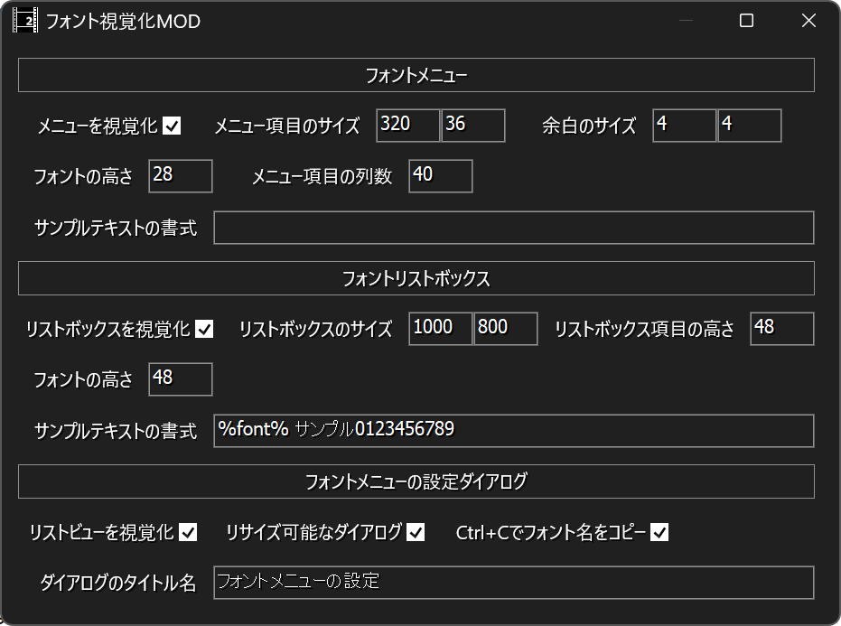
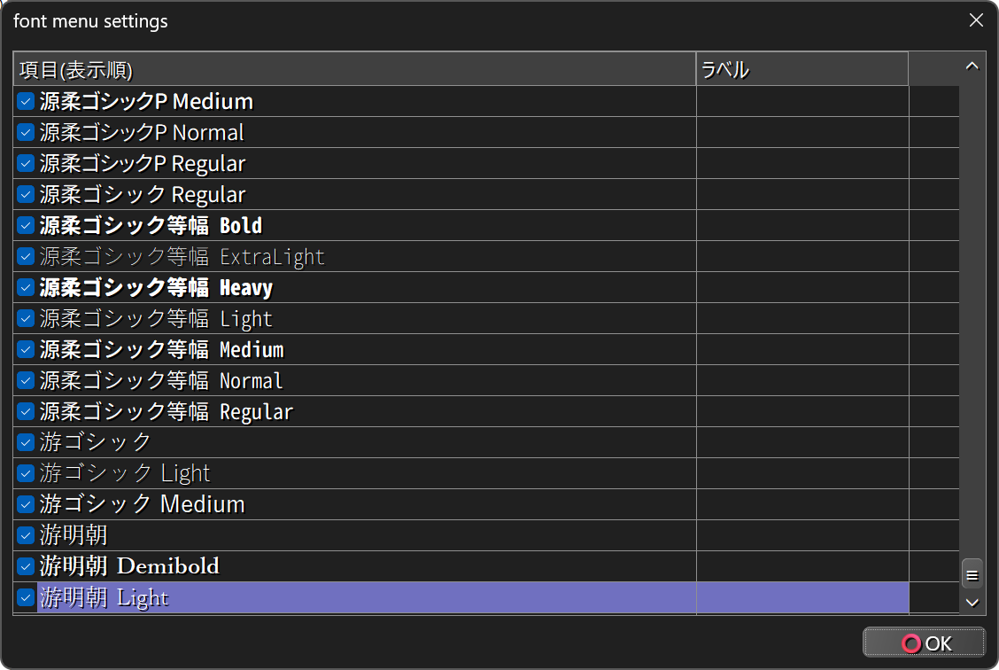
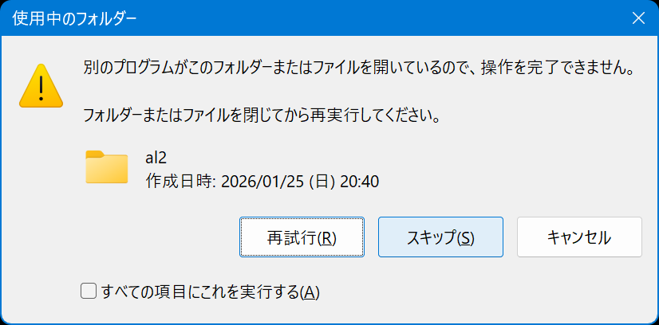

# 🎉AviUtl2フォント視覚化MOD

* aviutl2のフォントを視覚的に選択できるようにするMODです。
* aviutl2の汎用プラグインの形式になっていますが、実際には見た目を変えるタイプのMODです。

## 🚧注意事項

* `データフォルダ`とは`C:\ProgramData\aviutl2`または`aviutl2.exeがあるフォルダ\data`のことです。
* `プラグインフォルダ`とは`データフォルダ\Plugin`のことです。

> [!IMPORTANT]
> * aviutl2 beta30以降でのみ動作します。

## 🚀インストール

* `プラグインフォルダ`に以下のファイルを入れてください。
	* `al2` (フォルダ)
		* `al2_visual_font.aux2`
	* (上記ファイルは`al2_visual_font.au2pkg.zip`ファイル内の`Plugin`フォルダに入っています)
---
* または、`al2_visual_font.au2pkg.zip`ファイルをaviutl2のプレビュー画面にD&Dしてください。
* このとき「`al2`フォルダが使用中です」のようなダイアログが表示された場合は「スキップ」を選択してください。

## 🔥アンインストール

* `プラグインフォルダ`から以下のファイルを削除してください。
	* `al2/al2_visual_font.aux2`
	* `al2/config/al2_visual_font.json`

## 💡使い方

### 🏷️フォントメニューで視覚的に選択する

1. aviutl2で`テキストオブジェクト`を作成します。
1. `オブジェクト設定`で`フォント`ボタンをクリックします。
1. フォントメニューの項目が実際のフォントで表示されるはずです。
---
* **フォントメニューをカスタマイズしている場合は、トップレベルのメニューにフォント名の項目を含めるようにしてください。**

### 🏷️フォントリストボックスで視覚的に選択する

1. aviutl2で`テキストオブジェクト`を作成します。
1. `オブジェクト設定`で`フォント名`をクリックします。
1. フォントリストボックスの項目が実際のフォントで表示されるはずです。

### 🏷️『フォントメニューの設定』ダイアログで視覚的に選択する

1. aviutl2のメニューから`設定`➡`フォントメニューの設定`を選択します。
1. 『フォントメニューの設定』ダイアログが表示されます。
1. ダイアログ内のリストビューの項目が実際のフォントで表示されるはずです。

### 🏷️設定を初期化する

1. aviutl2を起動していない状態で以下のファイルを削除してください。
	* `al2/config/al2_visual_font.json`

## 🔧設定

* `フォント視覚化MOD`ウィンドウで設定します。
---
* `フォントメニュー`
	* `メニューを視覚化` ✏️チェックを入れるとフォントメニューを実際のフォントを使用して描画します。
	* `メニュー項目のサイズ` ✏️メニュー項目のサイズをpx単位で指定します。
	* `余白のサイズ` ✏️項目の矩形とテキストの間の余白をpx単位で指定します。
	* `フォントの高さ` ✏️フォントの高さ(描画サイズ)を指定します。
	* `メニュー項目の列数` ✏️メニュー項目の最大列数を指定します。これによりメニュー項目が改行されます。
		* `0`の場合は改行しません。
	* `サンプルテキストの書式` ✏️項目名の表示書式を指定します。
		* 空の場合は項目名だけが表示されます。
		* `%font%`は元の項目名に置換されます。
		* 例えば`%font% 0123456789`と指定していて、項目名が`Arial`の場合、`Arial 0123456789`と表示されます。
* `フォントリストボックス`
	* `リストボックスを視覚化` ✏️チェックを入れるとフォントリストボックスを実際のフォントを使用して描画します。
	* `リストボックスのサイズ` ✏️リストボックス(ウィンドウ)のサイズをpx単位で指定します。
	* `リストボックス項目の高さ` ✏️項目の高さ(大きさ)をpx単位で指定します。
	* `フォントの高さ` ✏️フォントの高さ(描画サイズ)を指定します。
	* `サンプルテキストの書式` ✏️`フォントメニュー`のものと同じように指定します。
* `フォントメニューの設定ダイアログ`
	* `リストビューを視覚化` ✏️チェックを入れるとリストビューを実際のフォントを使用して描画します。
	* `リサイズ可能なダイアログ` ✏️チェックを入れるとダイアログをリサイズできるようにします。
	* `Ctrl+Cでフォント名をコピー` ✏️チェックを入れると`Ctrl+C`を押したとき選択されているフォント名をクリップボードにコピーします。
	* `ダイアログのタイトル名` ✏️通常は`フォントメニューの設定`を指定します。
		* aviutl2の仕様が変わった場合はそれに合わせて変更してください。

## 🔖更新履歴

* 🔖r1 #2026年01月25日
	* 🎉初版

## ⚗️動作確認

* AviUtl ExEdit2 beta30 https://spring-fragrance.mints.ne.jp/aviutl/

## 💳クレジット

* AviUtl ExEdit2 Plugin SDK https://spring-fragrance.mints.ne.jp/aviutl/
* Microsoft Research Detours Package https://github.com/microsoft/Detours
* JSON for Modern C++ https://github.com/nlohmann/json

## 👽️作成者情報
 
* 作成者 - 蛇色 (へびいろ)
* GitHub - https://github.com/hebiiro
* X - https://x.com/io_hebiiro

## 🚨免責事項

この作成物および同梱物を使用したことによって生じたすべての障害・損害・不具合等に関しては、私と私の関係者および私の所属するいかなる団体・組織とも、一切の責任を負いません。各自の責任においてご使用ください。
